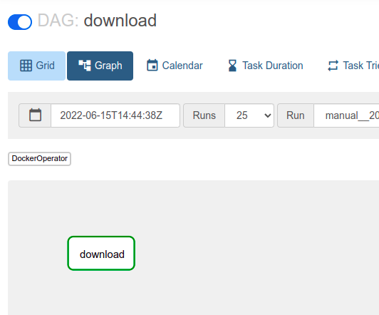
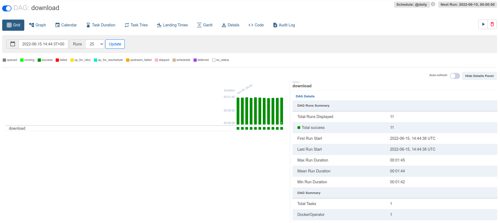
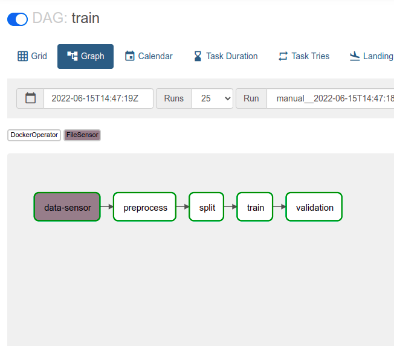
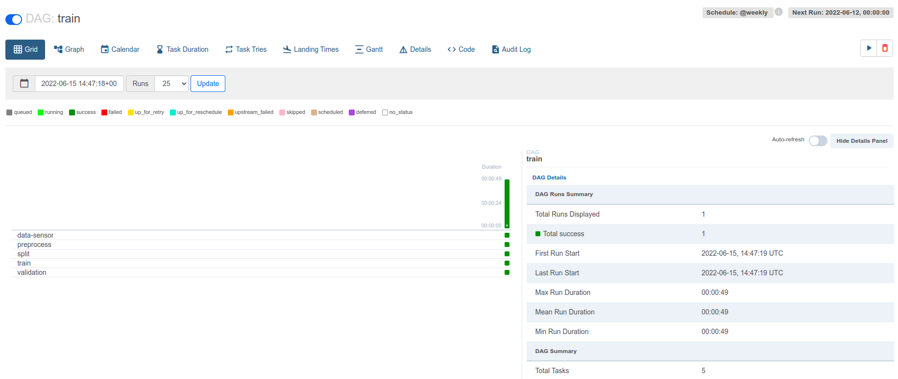
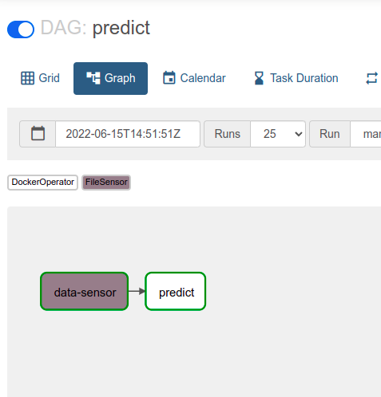
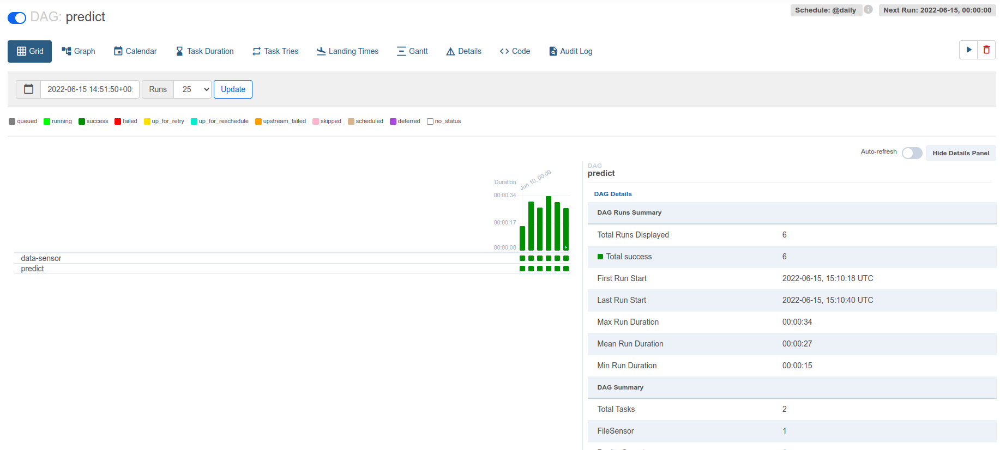

# Машинное обучение в продакшене. ДЗ 3

## Хмелёв Алексей, MADE-DS-22

### Запуск airflow (необходимо находиться в `airflow_ml_dags`):

```
export FERNET_KEY=$(python3 -c "from cryptography.fernet import Fernet; FERNET_KEY = Fernet.generate_key().decode(); print(FERNET_KEY)")
export HOST_DATA_DIR="$(pwd)"/data
docker-compose up --build
```

### Описание дагов:

`download` - ежедневно загружает данные в `/data/raw/{{ ds }}`.

`train` - еженедельно обучает модель. Берет данные из `/data/raw/{{ ds }}`, предобрабатывает данные (заменяет пропуски средним значением по столбцу) и кладет результат в `/data/processed/{{ ds }}`, делит данные на train/test и кладет их в `/data/split/{{ ds }}`, обучает модель на train и валидирует на test, кладет модель и метрики в `/data/models/{{ ds }}`.

`predict` - ежедневно использует модель для предсказаний таргета по данным из `/data/raw/{{ ds }}`. Предсказания кладутся в `/data/predictions/{{ ds }}`

### Скриншоты:

#### Список всех дагов:


#### Даг `download`:



#### Даг `train`:



#### Даг `predict`:



### Баллы:

#### Основная часть: 
1. Реализуйте dag, который генерирует данные для обучения модели (генерируйте данные -- можете использовать как генератор синтетики из первой дз, так и что-то из датасетов sklearn). Вам важно проэмулировать ситуации постоянно поступающих данных (5/5)
2. Реализуйте dag, который обучает модель еженедельно, используя данные за текущий день. В вашем пайплайне должно быть как минимум 4 стадии, но дайте волю своей фантазии =) (10/10)
3. Реализуйте dag, который использует модель ежедневно для предсказаний (5/5)
4. Все даги реализованы только с помощью `DockerOperator` (10/10)
5. Традиционно, самооценка (1/1)

#### Дополнительная часть
1. Реализуйте сенсоры на то, что данные готовы для дагов тренировки и обучения (3/3)
2. Протестируйте ваши даги (0/5)
3. В `docker compose` так же настройте поднятие `mlflow` и запишите туда параметры обучения, метрики и артефакт (модель) (0/5)
4. Вместо пути в airflow variables используйте API Mlflow Model Registry. Даг для инференса должен подхватывать последнюю продакшен модель (0/5)
5. Настройте alert в случае падения дага (0/3)

Суммарные баллы: 34/52
